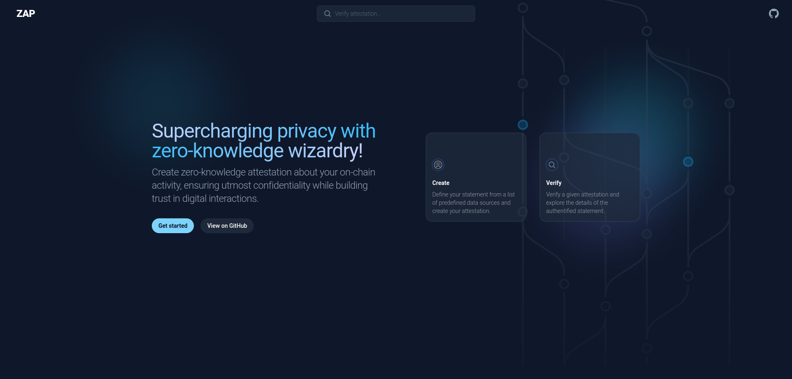

<a name="readme-top"></a>
[](https://github.com/julio4/zap)

<!-- PROJECT LOGO -->
<br />
<div align="center" display="flex" flex-direction="row" justify-content="center" align-items="center">
  <a href="https://www.developerdao.com/fr">
    
  </a>
  <a href="https://minaprotocol.com/" style="margin-left: 55px">
    
  </a>
  </p>
</div>

<p>
ZAP is a project developed as part of the ETHGlobal hackathon which utilizes the Mina blockchain protocol and Airstack as it's decentralized data provider. With ZAP, a user can verify a statement based on on-chain data from Ethereum without revealing anything but the fact that the statement has been verified for their EVM wallet.
</p>

<!-- TABLE OF CONTENTS -->
<summary>Table of Contents</summary>
<ol>
<li>
    <a href="#about-the-project">About The Project</a>
</li>
<li>
    <a href="#how-it-works">How It Works</a>
</li>
<li>
    <a href="#key-features">Key Features</a>
</li>
<li>
    <a href="#how-to-test">How to Test</a>
    <ul>
    <li><a href="#dapp">dApp</a></li>
    <li><a href="#local-installation">Local Installation</a></li>
    </ul>
</li>
<li>
    <a href="#more-to-come">More to Come</a>
</li>
<li>
    <a href="#license">License</a>
</li>
<li>
    <a href="#contributing">Contributing</a>
</li>
<li>
    <a href="#acknowledgements">Acknowledgements</a>
</li>
<li><a href="#contact">Contact</a></li>
</ol>
<br />
<!-- ABOUT THE PROJECT -->

## About The Project

ZAP allows a user to verify a specific statement related to their Ethereum wallet without having to disclose unnecessary information. The statement could be related to anything based on on-chain data, like the Ethereum balance or a user's lens profile. The user only needs to sign a message on MetaMask to authenticate and then specify the statement they want to verify via our frontend.

Despite being built on a centralized oracle, we've incorporated steps in our smart contracts to ensure trustlessness. For instance, we check that the input data is from our oracle and also compare the hash of the API query path with that of the first oracle request query.

<br />

<p align="center">
  
</p>
<p align="right">(<a href="#readme-top">back to top</a>)</p>

## How it works

1. The user signs a message on MetaMask for authentication.
2. The user specifies a statement they wish to verify through our frontend.
3. The user connects their Mina wallet to our frontend and sends their MetaMask signature with the statement to be verified.
4. The statement is sent to our oracle, which is linked to AirStack.
5. The oracle queries the appropriate API to verify the statement.
6. If the statement is true, the oracle emits an event containing "verified", and the statement hash.
7. The user can now prove to anyone that they have verified the statement by providing their statement hash and Mina wallet address.
8. The external watcher can hash the received data and check that the result has been emitted by our oracle. If it matches, the proof is correct.

<p align="center">
  
  Excalidraw
</p>
<p align="right">(<a href="#readme-top">back to top</a>)</p>

## Powered by AirStack

AirStack plays a crucial role in the ZAP project as our primary data provider. When a user wishes to verify a statement, it is AirStack that our oracle queries for the appropriate data. AirStack's extensive API and data offerings enable us to verify a wide array of statements related to Ethereum on-chain data.

Notably, AirStack's simplicity and flexibility have allowed us to perform recursive calls with data processing. For instance, we use AirStack to compute the total volume of NFT sales for a given user, a complex task that showcases the power and versatility of our system when combined with AirStack's data services.

By integrating with AirStack, ZAP can provide robust, accurate, and reliable verification for its users. The strong compatibility between AirStack's APIs and our oracle enables a seamless data exchange, ensuring efficient and speedy statement verification.

In our journey towards a more decentralized and privacy-focused world, we appreciate support and services provided by AirStack.

<p align="right">(<a href="#readme-top">back to top</a>)</p>

### Key Features

- Trustlessness: We have incorporated steps in our smart contracts to ensure trustlessness by verifying the signature input and checking the statement truthfulness.
- Privacy Preservation: Users can verify statements about their Ethereum wallets without revealing unnecessary information.
- Interoperability: ZAP connects Ethereum and Mina, leveraging the strengths of both.
- User-friendly: Users can easily specify the statement they wish to verify through our frontend.

### Example of statements

We have implemented in the frontend a few examples of statements that can be verified. Keep in mind that you have to specify a target value (number) and a condition type (>, <, =, >=, <=).
Here are some examples:

- ERC20 balance: 'my balance of DAI is greater than 1000'
- ERC721 balance: 'I hold more than 4 CryptoKitties'
- Lens profile: 'I got a lens profile'
- Farcaster profile: 'I hold a Farcaster profile'
- Ens domains: 'I own more than 2 ENS domains'
- POAP: 'I have attended to ETHGlobal Tokyo Hackathon'
- XMTP: 'XMTP is enabled on my wallet'
- NFT volume sales: 'In total, I have sold for more than 15 ETH of NFTs'

<!-- GETTING STARTED -->

## How to test

#### dApp

To test the dApp (website), you will need:

- A web3 wallet, such as [Auro Wallet](https://www.aurowallet.com/)
- A Mina account with some tokens
- A MetaMask wallet

You can then test the dApp here: [Website](zap.vercel.app)

### Local installation

If you want to test and run the dApp locally, you will need:

    Node.js
    Yarn or npm

- Clone the repo

```sh
git clone https://github.com/julio4/zap.git
```

- Install package dependencies using pnpm

```sh
pnpm i
```

- Compile the contracts

```sh
pnpm build
```

You can run the smart contract tests. Note that it does use some mock (especially for Oracle and Airstack). We didn't implement end-to-end tests.

```sh
cd contracts/zap/ && npm run build && npm run test
```

<p align="center">
  
</p>

<p align="right">(<a href="#readme-top">back to top</a>)</p>

<!-- GOAL -->

</br>

### More to come

- Additional Statements: We plan to expand the range of verifiable statements. This will allow users to provide proof for a wider variety of on-chain data from Ethereum. Furthermore, we anticipate deepening our integration with AirStack to leverage more of their extensive API and data services for more complex statement verification.

- Recursive Proofs: Leveraging Mina's unique technology, we intend to implement recursive proofs. This will allow users to combine several proofs off-chain and verify them on-chain in a single transaction, saving resources and improving efficiency.

- Decentralization Efforts: We are exploring potential solutions to move away from a centralized oracle, aiming to make the system fully trustless and further enhance its security. As part of this process, we are considering ways to leverage AirStack's APIs in a more decentralized context. We anticipate that having AirStack's data responses signed would enable us to validate on-chain that the data indeed originates from AirStack, further bolstering the system's credibility and security.

- User Interface Improvements: Given the time constraints inherent in hackathons, we recognize the need for further refining our frontend. Our goal is to ensure a seamless and user-friendly experience, so we plan to invest time and effort in enhancing the interface's usability and aesthetics.
  </br>

### Challenges and Difficulties

In a project like this, where there are three key players each with their specific roles, maintaining the balance can be tricky. The challenge is to connect everything without accidentally revealing information we want to keep hidden. The toughest part was undoubtedly linking all the components together. This called for an organized architecture and strong typing, both of which are very time-consuming tasks. And let's be honest, in a hackathon, time is the real treasure! We had planned to integrate recursive proofs, but we simply ran out of time. Despite these obstacles, we've learned a lot and are excited about what we've accomplished.

### License

Distributed under the MIT License. See `LICENSE` for more information.

### Contributing

We welcome all contributions to the ZAP project. If you have any suggestions, please open an issue to discuss the changes you would like to make. You can also fork the repo and create a pull request with your changes, or contact us directly.

## Acknowledgements

We want to extend our gratitude to both the Mina Protocol team and AirStack for providing the opportunity to create ZAP for this hackathon. Opportunities like these are instrumental for young developers like us, to not only learn and innovate, but also contribute to the evolving landscape of the blockchain space.

Now that we've dipped our toes in the Mina Protocol universe for the second time with this hackathon, we're really stoked to continue our web3 adventure with this amazing team and their vibrant community. We can't wait to see where this journey takes us next!

We'd also like to express our gratitude to AirStack for their help and support throughout that weekend, we are more than interested in continuing to work with them for our future projects.

Lastly, it's important to acknowledge the comprehensive documentation provided by both Mina Protocol and AirStack. Such helpful resources can be a rarity in the web3 ecosystem, and we highly appreciate their efforts in this regard

## Contact

<br />
Twitter:

- [Ainullindale](https://twitter.com/Ainullindale)
- [julio4](https://twitter.com/julio4__)

<br />

<p align="right">(<a href="#readme-top">back to top</a>)</p>
