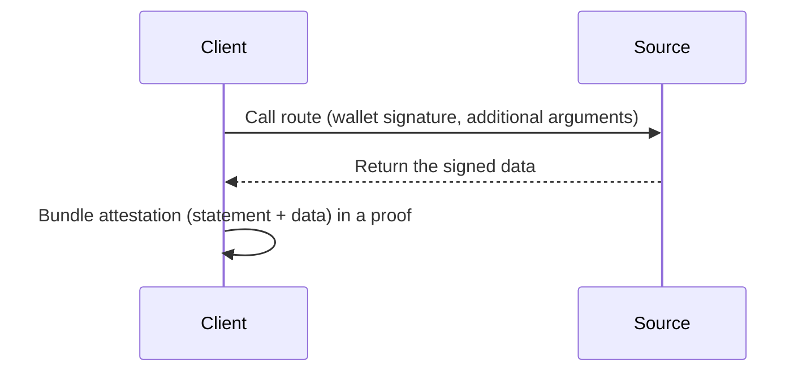
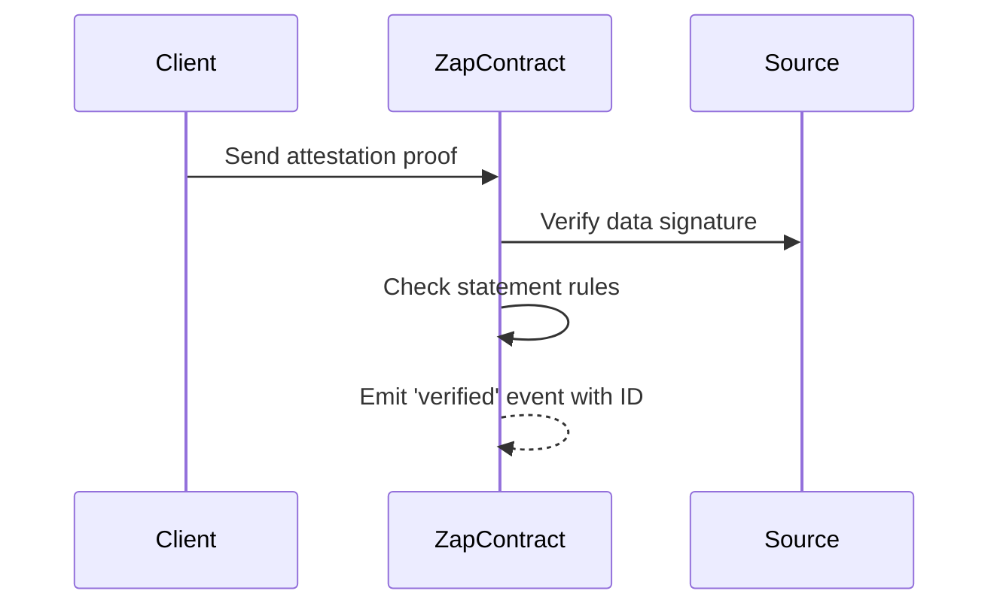
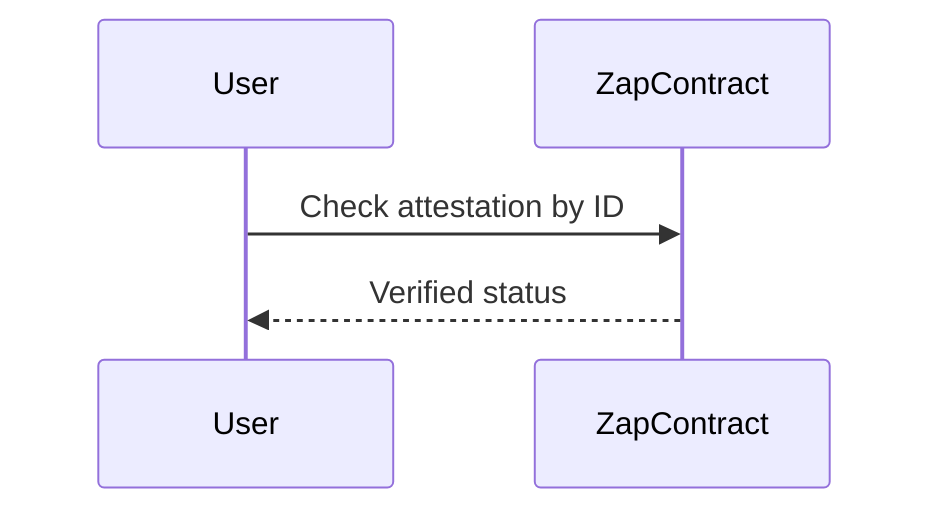
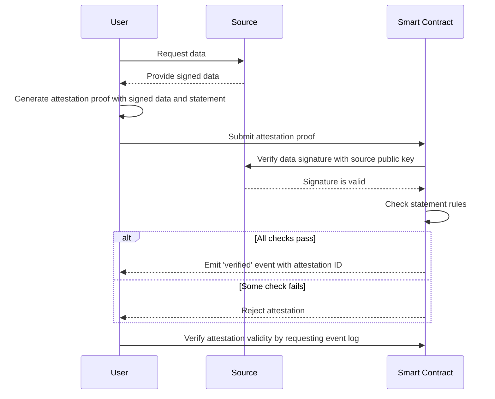

# ZAP Protocol

ZAP is a protocol for creating and verifying zk-attestation on Mina.

Because we are in the context of a ZkApp, the protocol is split in two parts: on-chain and off-chain.
The off-chain parts is implemented using `o1js` and executed in a private environment: the user web-browser.
The on-chain parts is implemented using a smart contract on the Mina blockchain, and is responsible to verify the off-chain generated proof.

However, ZAP also need to verify the data provided by the user, so a third part is needed: the [ZAP Source](./concepts/ZAPSource).
The source is implemented as an API server, and is responsible to provide the data that the user will use to generate the attestation.
All data emitted by the source are signed by the source private key, that way the ZAP contract is able to verify the attestation data integrity with the source public key.

## Off-chain

### Source exposes routes

The source expose differents routes, each route is responsible to provide a specific data.
It's implemented as a simple HTTP API, however each call is authentified by the user Mina wallet signature, and the returned value is signed by the oracle private key.
This allows to be able to verify that a specific chunk of data was provided by the oracle for given user, source, route and arguments.

### User define a statement using available routes

As we saw in the previous section, a statement is a set of variables and rules.

In ZAP, the statement is composed of a source, a route (of this source), a condition and a target value.
This represents the logic that needs to be true for the attestation to be considered valid.

> Now, a statement concerns only one variable and one condition. \
> However, thanks to the power of recursive proofs and [partial attestations](concepts/Attestation#combining-attestations-and-statements-together-for-modularity-and-scalability) we plan to extend statement to support multiple variables and conditions by combining multiple statements together.

### Attestation Proof Generation

After receiving the signed value from the source, the user can bundles it with the statement conditions into a zero-knowledge proof.

## On-chain

### Attestation proof submission and verification

The user can now submit the attestation proof to the ZAP contract.
First, the contract verifies the integrity of the data by verifying the signature against the stored source public key, and second, it ensures that the rules of the statement are validated.
Upon successful verification, a 'verified' event is emitted with the attestation ID.

### Attestation storage

From now on, the verified attestation id is stored in the event log of the contract.

##### Attestation Check

Anyone can easily check the validity of an attestation by exploring the event log of the contract.

## Overall flow

## Archive diagrams

The following diagrams were made in the first version of the protocol, and are not up-to-date anymore.
They are however included here as they can be useful to understand the overall protocol.

